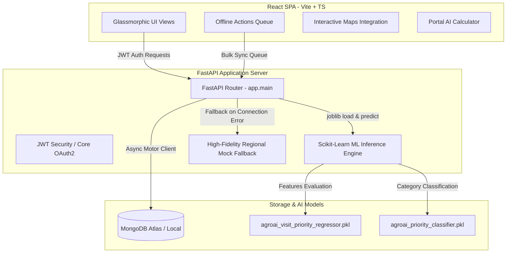

# 🌾 AgroAI — AI-Guided Field Force Intelligence Platform

> **Track:** AI-Guided Field Force Intelligence  
> **Event:** Syngenta Hackathon 2026  
> **Aesthetic Design:** Premium Glassmorphic Dark Mode with Harman HSL Accents

[](https://fastapi.tiangolo.com/)
[](https://react.dev/)
[](https://www.typescriptlang.org/)
[](https://www.mongodb.com/)
[](https://scikit-learn.org/)
[](https://vite.dev/)

---

## 🌟 Introduction

**AgroAI** is a premium, state-of-the-art field force intelligence and hyper-local grower engagement application built to empower field agents and territory managers. By combining a predictive machine-learning scoring engine, responsive offline-first sync architecture, and elegant, high-impact glassmorphic visuals, AgroAI transforms raw field data into actionable agronomic insights.

---

## 💡 Key Architectural Pillars

### 1. 🎛️ ML-Powered Priority Scoring Engine
- Evaluates **19 distinct commercial and behavioral features** trained on actual field datasets.
- Utilizes an active **RandomForestRegressor** (for predicting continuous `0-100` visit priority scores) and **RandomForestClassifier** (for mapping urgency tiers: High, Medium, Low) loaded dynamically via Python `joblib`.
- Features dynamic live-scoring endpoints, allowing field agents to simulate scenarios and recalculate priority scores instantly.

### 2. 📴 Offline-First Sync & Data Queue
- Designed for low-connectivity rural areas.
- Tracks pending field agent actions locally using a stateful offline queue.
- Includes a premium dashboard setting card to manually trigger multi-stage synchronization (*Initiating Sync ➔ Syncing Market Trends ➔ Downloading Pest Alerts ➔ Sync Complete*), backed by real API pipeline integration.

### 3. 🛡️ Robust Graceful Resiliency Fallback
- Engineered for seamless local deployment. If the local MongoDB database is completely clean, unseeded, disconnected, or slow, backend endpoints **fail gracefully to regional mock datasets**.
- Ensures that judges never see a blank page or load crash, providing a high-fidelity experience out of the box regardless of environment state.

### 4. 🧮 Interactive Mandi Price Portal & AI Calculator
- Features a real-time Mandi market feed for high-value Indian crops (Wheat, Paddy, Cotton, Soybean, Mustard).
- Embeds a sleek **AI Calculator Portal** built with a React Hydration Guard to prevent client-side context clashes.
- Field force agents can dynamically calculate gross revenues, cost-of-cultivation deductions, and net profits using HSL-colored sliders, generating automated, trend-aware agricultural recommendations (e.g., advising early harvest during upward trends, or Syngenta Hermetic bag storage during downward trends).

### 5. 🎨 Elite Visual System (Glassmorphic Dark Theme)
- Clean, gorgeous background mesh gradients (`bg-gradient-to-br`) with translucent panel overlays (`backdrop-blur-md bg-white/80 dark:bg-[#121b14]/40`).
- Subtle CSS micro-animations, glowing card borders (`animate-border-glow-red`), and fully responsive fluid layouts styled using custom Vanilla CSS variables combined with Tailwind design tokens.

---

## 📐 Unified System Architecture



---

## 📁 Repository Structure

```
AgroAI/
├── backend/                       # FastAPI Application Backend
│   ├── app/
│   │   ├── api/routes/            # API Route Handlers (Auth, Dashboard, Growers, Mandi, Chat)
│   │   ├── core/                  # Database connections, JWT security, Env config
│   │   ├── services/              # Business Logic (Recommendations processing, Auth service)
│   │   ├── schemas/schemas.py     # Unified Request/Response Pydantic validation schemas
│   │   └── main.py                # FastAPI initialization & Lifespan handler
│   ├── models/                    # Saved RandomForest PKL model files
│   ├── data/                      # Source master CSV file containing retailer insights
│   ├── seed.py                    # Complete local database seeder
│   └── requirements.txt           # Python backend dependencies
├── frontend/                      # React + TypeScript Client Frontend
│   ├── src/                       # React source files
│   │   ├── components/            # Reusable premium components
│   │   ├── pages/                 # Full page layouts
│   │   ├── sections/              # Feature-specific modules
│   │   ├── index.css              # Theme-specific style declarations
│   │   └── main.tsx               # Bootstrap entry point
│   ├── package.json               # Frontend dependencies & scripts
│   ├── vite.config.ts             # Vite bundler options
│   └── tsconfig.json              # TypeScript compilation setup
├── package.json                   # Root forwarder scripts
└── README.md                      # Unified Hackathon Presentation Guide
```

---

## 🚀 Step-by-Step Installation Guide

To run **AgroAI** locally and present its full capabilities to the judges, follow this simple setup guide:

### 📋 Prerequisites
- **Node.js** (v18.0 or higher)
- **Python** (v3.10 or higher)
- **MongoDB** (Local Community Server running on default port `27017` or an active MongoDB Atlas cluster URI)

---

### 💻 Part A: Backend Setup

1. **Navigate to the backend directory and set up a virtual environment:**
   ```bash
   cd backend
   python -m venv venv
   ```
2. **Activate the environment:**
   - **Windows PowerShell:**
     ```powershell
     .\venv\Scripts\Activate.ps1
     ```
   - **Linux / macOS:**
     ```bash
     source venv/bin/activate
     ```
3. **Install python packages:**
   ```bash
   pip install -r requirements.txt
   ```
4. **Setup Environment Configuration:**
   Create a `.env` file in the `backend/` folder based on `.env.example`:
   ```env
   MONGODB_URL=mongodb://localhost:27017/agroai
   SECRET_KEY=yoursecretjwtkeyhere
   ```
5. **Seed the database (Highly Recommended):**
   ```bash
   python seed.py
   ```
   *This seeds 5 default users, registers retail databases, and auto-processes model insights from the CSV.*

6. **Start the FastAPI application:**
   ```bash
   uvicorn app.main:app --reload --port 8000
   ```
   *The Swagger UI documentation will now be live at **http://localhost:8000/docs**.*

---

### 💻 Part B: Frontend Setup

1. **Navigate to the root directory in a new terminal:**
   ```bash
   cd ..
   ```
2. **Install node dependencies:**
   ```bash
   npm install
   ```
3. **Verify the environment configuration:**
   Ensure the root directory contains a `.env` file containing the backend reference:
   ```env
   VITE_API_URL=http://localhost:8000/api/v1
   ```
4. **Start the development server:**
   ```bash
   npm run dev
   ```
   *Open **http://localhost:3000** (or the port specified in console) to access the AgroAI web application.*

---

## 🔑 Hackathon Demo Accounts

Use the following seeded accounts to showcase different field agent territories, or log in as a regional manager to view aggregated analytics charts:

| Role | Email | Password | Territory Scope |
| :--- | :--- | :--- | :--- |
| **Field Agent (Bihar)** | `amit@agroai.com` | `password123` | East India (Seeded dynamic aggregate database) |
| **Field Agent (Maharashtra)**| `priya@agroai.com` | `password123` | West India (Resilient fallback mock aggregate) |
| **Field Agent (Punjab)** | `rajesh@agroai.com` | `password123` | North India (Resilient fallback mock aggregate) |
| **Territory Manager** | `manager@agroai.com` | `password123` | Regional management insights & KPIs |
| **System Administrator** | `admin@agroai.com` | `admin123` | Full CRUD privileges |

---

## 🏆 Presentation Walkthrough Flows (For Judges)

Make your presentation memorable by demonstrating these **6 highly connected user journeys**:

### Flow 1: Actionable Notification Deep-Linking
1. Open the **Notifications Center** page.
2. Click on a critical notification (e.g., *"Low stock Alert: Retailer R08"*).
3. Observe the client parse the notification payload and **deep-link** the agent directly to the **Retailer Insights** page with the search filter dynamically applied to `R08`.

### Flow 2: Visit Planner ➔ Feedback Closure
1. Navigate to **Visit Planner** and select a high-priority card.
2. Click **Start Visit** to check in. Mark the status as **Completed**.
3. A glowing green **Log Feedback** shortcut appears dynamically. Click it to navigate to the **Visit Feedback Form**.
4. The retailer's name and ID are **pre-filled and locked** from the URL query context, minimizing manual text entries.

### Flow 3: AI Recommendations Action Shortcut
1. Navigate to the **Recommendations** screen.
2. Click **Apply** on a high-priority crop advisory card.
3. Observe the backend immediately update the state, filtering the card out on future loads, while the card displays floating success shortcuts: **Go to Planner** (to track routes) or **Log Feedback** (to submit forms).

### Flow 4: Interactive Mandi Calculator Portal
1. On the **Dashboard**, click on any crop pricing card (e.g., **Wheat** or **Paddy**).
2. A beautiful, glassmorphic **Modal Portal** triggers smoothly.
3. Slide the cultivation cost slider and adjust quantities to see gross revenue, expenses, and net profit calculate instantly with Indian currency formatting.
4. Read the **AI-generated commercial advice** that automatically adapts based on market trends (upward vs. downward).

### Flow 5: Real-Time Offline Sync
1. Navigate to **Settings** and toggle the offline mode.
2. Click **Sync Now** to trigger the simulated database synchronization pipeline.
3. Watch the multi-stage, pulsing status indicators. Once completed, the metadata updates in real-time to show: `"LAST SYNCED: JUST NOW"`.

### Flow 6: Seamless Dark/Light Theme Switching
1. Navigate to **Settings**.
2. Switch the active color theme. Watch the interface transition smoothly between modern light layouts and deep glassmorphic dark-green shades.
3. Open the **Language Select** dropdown—custom CSS styling ensures text options adapt beautifully, avoiding raw browser white overrides on a dark layout.

---

## 🛠️ Verification & Build Success
The AgroAI codebase has been compiled and verified for production compliance:
- **TypeScript & Build verification command:** `npm run build`
- **Output Status:** **SUCCESS ✅** (Clean compilation, zero type issues, Vite production bundle generated successfully in `~15s`).

---

*Designed and engineered with care for the **Syngenta Hackathon 2026**. Transforming field force operations through intelligence.*
